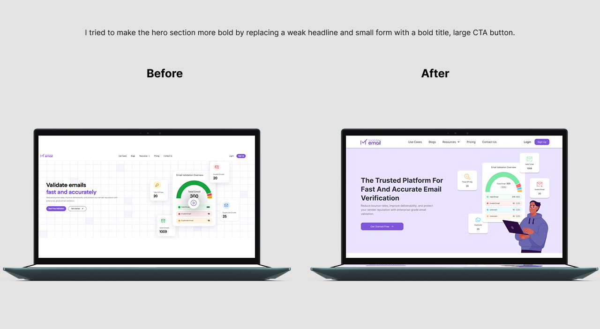
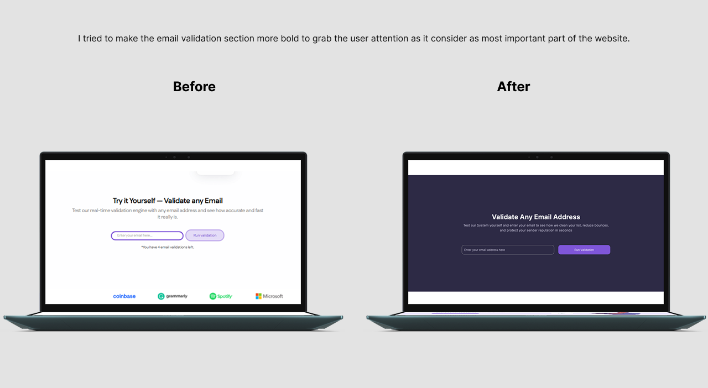
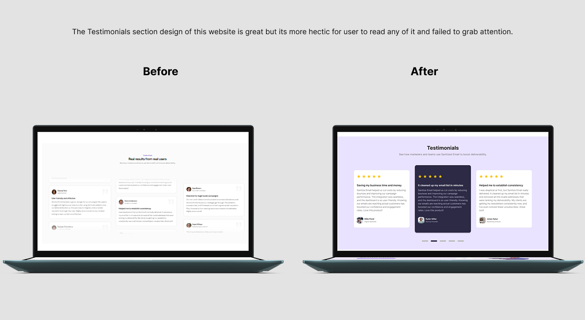
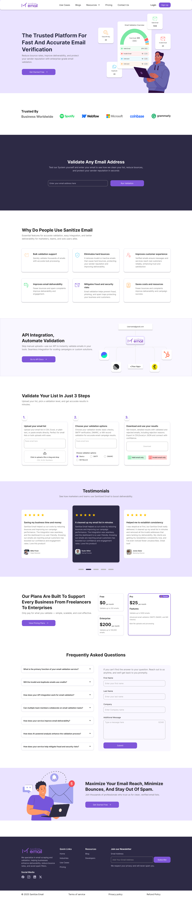

# View on Figma

[Figma Project Link – RedesignEmailValiation_Website](https://www.figma.com/design/8Y5dcMqK0H0pgY2t87FklT/Sanitize-Email?node-id=0-1&t=6nOewThFsafC7ti4-1)

## Sanitize Email – Landing Page Redesign

This is a case study on how i tried making an email validation website ( Sanitize email) clearer, modern, and easier to use.

## Overview

Sanitize Email is a tool that helps businesses verify email addresses to reduce bounce rates and improve deliverability. I decided to redesign this website because the old website had the right information but looked outdated, crowded, and hard to follow. 

My goal was to redesign the landing page to make it look cleaner, easier to understand, and more effective at guiding users to take action.

## What I Wanted to Achieve

- Make the website easier to read and navigate.
- Highlight important buttons like “Validate Email” and “Start Free Trial”.
- Build trust with a clean, professional look.
- Organize sections so users understand what the tool does quickly.

## What I Noticed in the Original Design

- The layout felt crowded and overwhelming.
- The main buttons didn’t stand out enough because of color they used is too strong than primary color.
- There are no clear path to guide visitors through features and benefits.
- Important sections like testimonials were hard to read and cannot stand out.

## My Role

I worked on this project by myself as a personal design challenge. I planned the new layout, designed the wireframes, and created the final user interface in Figma.

## Tools Used

- Figma
- Photoshop

## Design Process

## Research

I looked at other email validation websites to see what makes them easy to use. I paid attention to layouts, CTA buttons, and how they explain features. I also reviewed SaaS landing pages to learn how they build trust.

## Typography

Font Used : Inter 

Font size and Weight: 
Heading: 48px, 40px, 32px, 24px, 20px / Bold 

Paragraph:  
P1: 16px / Bold, Semi bold, Medium, Regular 
P2: 14px/ Bold, Semi bold, Medium, Regular 

Caption: 
C1: 12px / Semi bold, Medium, Regular 
C2: 10px/ Semi bold, Medium, Regular 

## Color Palette

| Usage            | Hex Code   
|------------------|-----------
| Primary Color    | #7F56D9  
| Secondary Color  | #EAE3FF   
| Text Primary     | #1E1E1E 
| Text Secondary   | #6B6B6B  
| Background Color | #2B2D42   

## Before and after of redesign landing page

## Design Preview

